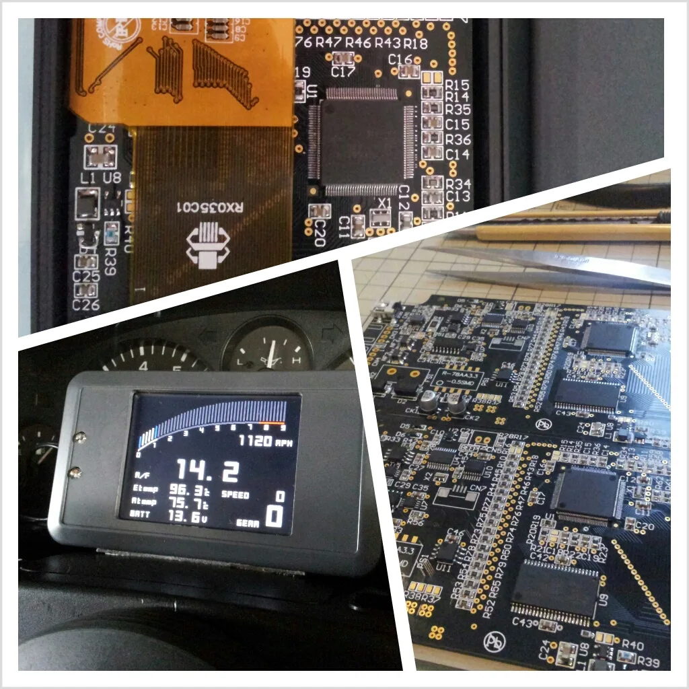

### FULL-MONI フルモニ

## ０．注記
 - このリポジトリは過去に開発を行ったものを参考公開しています。
 - 回路に含む電子部品はディスコンも多く、再生産は困難です。
 - ファームウェアの更新の予定もありません。
## １．フルモニとは
 - フルコンモニターの略称で、「フルモニ」。
 - 各種フルコン（対応機種随時予定）やＤＥＦＩのコントロールユニットⅠ/Ⅱから取得したデータを
 - ３．５インチＴＦＴ液晶に数値やグラフとしてリアルタイム表示します。

 - 各データの取得は、
 - フルコンからのデータは、ＣＡＮまたはＲＳ２３２Ｃ信号ケーブルを接続し、
 - ＤＥＦＩコントロールユニットⅠ/Ⅱからのデータは、
 - フルモニ専用のメータリンクケーブルを接続することで、データを受信します。

 - 表示データはそれぞれの表示選択や、ピークホールド表示、ワーニング表示を行います。

## ２．設計概要
 - 基板　　:　３．５インチＴＦＴ液晶を備えた基板を設計する。
 - ケース　:　タカチ電機工業製ＬＣＳ形シリコンケース付プラスチックケースを使用。
 -  　　　　　液晶、ＬＥＤ及び入力端子部分の切削加工を行う。

## ３．ハードウェア仕様
 - １２Ｖバッテリー車向け制御電源（ＤＣ＋４．７５～＋３２Ｖ　→　内部電源＋３．３Ｖ）
 - タッチパネルＩＦ付３．５インチＴＦＴ液晶
 - 液晶バックライト用電源(調光機能付)
 - ＣＰＵ　ルネサステクノロジ　Ｈ８ＳＸ１６５５　４８ＭＨｚ
 - 外部ＳＲＡＭ　４Ｍｂｉｔ（おもに液晶用ビデオバッファ用途）
 - ＣＡＮ２．０Ｂ送受信　　　１チャンネル
 - ＲＳ２３２Ｃ送受信　　　　１チャンネル（ＦＣロガー接続選択機能付）
 - ＤＥＦＩ用Ｉ／Ｆ受信のみ　１チャンネル
 - 超高輝度ＬＥＤ（赤・橙）
 - ケース内ブザー
 - タッチパネルＩ／Ｆ
 - ＳＰＩフラッシュＲＯＭ　４ｋｂｉｔ

## ４．回路設計
 - 2013年1月28日更新
 - SCH : [FULLMONI_revC_SCH_20130128_101.pdf](https://github.com/tomoya723/FULLMONI-Legacy/blob/4514685d8f7103bcbfc3824f94381c39d037f4da/Hardware/FULLMONI_revC_SCH_20130128_101.pdf) 

## ５．基板設計
 - 2013年3月6日更新
 -  PCB : [FULLMONI_revC_PCB_20130306_101.pdf](https://github.com/tomoya723/FULLMONI-Legacy/blob/c4a8cc1ee19b74c6463b97665e4f9444e0cc6ba2/Hardware/FULLMONI_revC_PCB_20130306_101.pdf) 

## ５．ケース設計
 タカチ LC135-Nをベースに加工
 Case data: [LCケース加工図面20121030.pdf](https://github.com/tomoya723/FULLMONI-Legacy/blob/f6450ae8e5cbf89b6b0861b6293d36d16016387c/Hardware/LC%E3%82%B1%E3%83%BC%E3%82%B9%E5%8A%A0%E5%B7%A5%E5%9B%B3%E9%9D%A220121030.pdf) 

## ６．基板作成仕様
 - 外形１３０．０ｍｍ×６６．０ｍｍ（但し外形はルーター加工特殊形状）
 - 板厚１．６ｍｍ
 - ＦＲ４(ガラスエポキシ)
 - 構成　４層（信号２層/電源２層）
 - 部品実装　片面　白色
 - レジスト　両面　黒色
 - 最小パタン幅０．２ｍｍ／最小クリアランス０．２ｍｍ
 - 最小穴径０．５ｍｍ
 - 無電解金フラッシュ仕上げ
